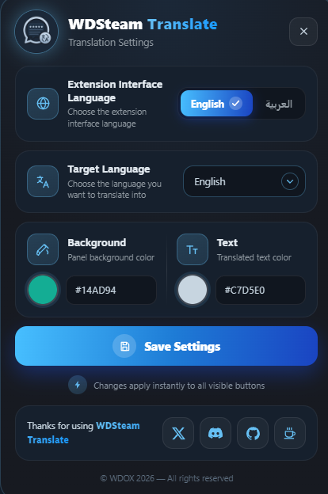
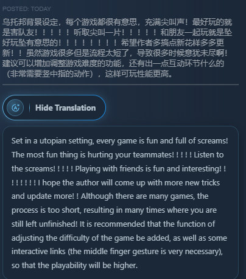
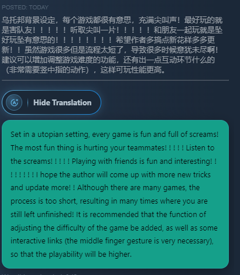
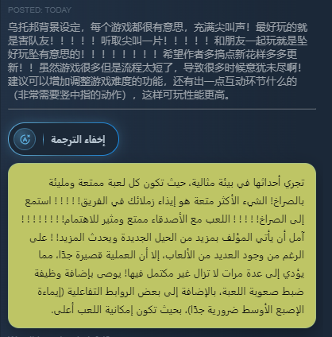
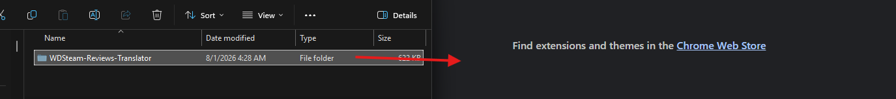
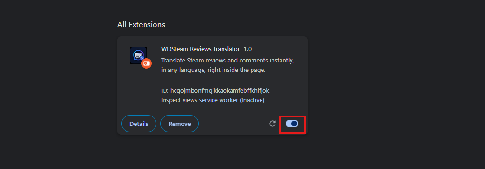

<p align="center">
  
</p>

<p align="center">
  <a href="README.md"></a>
  <a href="README-ar.md"></a>
</p>

# WDSteam Reviews Translator


Instant translation for **Steam** reviews and comments.

WDSteam Reviews Translator is a **Chrome** extension that adds a translate button under every review and comment on Steam, and shows the translation inside the same page without leaving it. Supported translation languages:

- 🇸🇦 Arabic (AR)

- 🇬🇧 English (EN)

- 🇫🇷 French (FR)

- 🇪🇸 Spanish (ES)

- 🇩🇪 German (DE)

- 🇷🇺 Russian (RU)

- 🇹🇷 Turkish (TR)

- 🇵🇹 Portuguese (PT)

- 🇨🇳 Simplified Chinese (ZH-CN)

- 🇯🇵 Japanese (JA)

- 🇰🇷 Korean (KO)

- 🇮🇳 Hindi (HI)

- 🇮🇹 Italian (IT)

- More coming soon

Works on:

- 🌐 Chrome and Chromium-based browsers.

-  🐵 Tampermonkey

- 🖥️ Works inside the Steam client through Millennium Installer.

---

## ✨ Features

- Translate any Steam review or comment with one click, and the translation shows up right under the original text.

- 13 translation languages with automatic detection of the original text language.

- Smart text extraction: only the review text is sent — page headings, dates, hours on record, `Recommended` / `Not Recommended`, `Yes / No / Funny / Award`, `Direct from Steam`, `Steam Key`, and game counters are blocked completely.

- The neighbouring review never leaks in, so the translation always matches the review you clicked.

- Long reviews are split and translated automatically, with no worry about character limits.

- Lightweight, needs no account, and does not affect Steam's performance.

---

## 📸 Extension screenshots

<p align="center">
  
  
   
    
	 
</p>

---


## 🎥 video

https://github.com/user-attachments/assets/c66829b2-a883-4050-948c-69a2c1c64d41


# 📥 Installation

## Chrome extension

1. Download or clone the project.

2. Open the extensions page:

   ```
   chrome://extensions
   ```

3. Enable **Developer Mode**.

4. Click **Load unpacked**.

5. Select the project folder.

---

## Tampermonkey

1. Install the **Tampermonkey** extension.

2. Import the **WDSteam-Reviews-Translator.js** file.

3. Open any Steam page and the script runs automatically.

---

## Steam client (Millennium Installer)

If you want to use WDSteam Reviews Translator inside **the Steam client itself** instead of the browser, follow these steps:

1. Install **Millennium Installer** on your device.

2. Open the Millennium settings.

3. Install the **Extensions** plugin.

4. Enter the following code:

   ```
   788ed8554492
   ```

5. After installing the **Extensions** plugin, install WDSteam Reviews Translator and it will run inside the Steam client directly.

<p align="center">
  
  
  
  
  
  
  
  
</p>

> The images above show the steps for installing the **Extensions** plugin inside the Millennium settings and entering the code `788ed8554492`.

---

# 🚀 Usage

Open any Steam store page, review page, or comment list, and a **Translate Review** button appears under every review and comment — click it and the translation shows up right below in the language you picked, and click again to hide it.

Use the ⚙️ button on the page to open the settings panel, where you can change the interface language, the translation language, and the translation box colours.

---

# 🔐 Permissions

The extension uses only the following permissions:

- `storage`

- Access to `translate.googleapis.com` to perform the translation.

> **The extension does not collect or send any personal data.**

---

# 📄 Privacy Policy

See the file:

`PRIVACY_POLICY.md`

---

# ⚖️ License

This project is licensed under the **MIT License**.

See the file:

`LICENSE`
